## Final Project Submission

Please fill out:
* Student name: Devin Belden
* Student pace: full time
* Scheduled project review date/time: 	Fri Feb 7, 2020 1:30pm – 2:30pm (MST)
* Instructor name: James Irving, Ph.D.
* Blog post URL: TBD

# Aim

For this project, we attempt to use existing data to predict how chess matches might end, given such variables as the type of opening, game length, and the ratings of the players. The possible endings, underneath the column `victory_status`, are checkmate, resignation, draw, and timeout. 

Due to having four classes, random guessing leads to an overall accuracy rating of 25%. We should then pick models that have an overall accuracy rating that is higher than this, and we should be sure to take into account model runtime as well.

# Importing, Exploration, and Preprocessing

First, we import relevant packages, as well as the dataset.


```python
import warnings
warnings.filterwarnings('ignore')

import pandas as pd
import numpy as np
from sklearn.metrics import plot_confusion_matrix
from sklearn.model_selection import (train_test_split, GridSearchCV, 
                                     RandomizedSearchCV)

from sklearn.preprocessing import StandardScaler
from sklearn.neighbors import KNeighborsClassifier
from sklearn.metrics import (precision_score, recall_score, 
                             accuracy_score, f1_score)

from imblearn.over_sampling import ADASYN,SMOTE
from sklearn.tree import DecisionTreeClassifier
from sklearn.ensemble import (AdaBoostClassifier,RandomForestClassifier,
                              BaggingClassifier,GradientBoostingClassifier,
                              ExtraTreesClassifier)

from xgboost import XGBClassifier,XGBRFClassifier
from sklearn.svm import SVC
from sklearn.tree import export_graphviz
from IPython.display import Image  
from pydotplus import graph_from_dot_data

pd.options.display.float_format = '{:.2f}'.format

df = pd.read_csv('games.csv')
df.head()
```


<div>
<style scoped>
    .dataframe tbody tr th:only-of-type {
        vertical-align: middle;
    }

    .dataframe tbody tr th {
        vertical-align: top;
    }

    .dataframe thead th {
        text-align: right;
    }
</style>
<table border="1" class="dataframe">
  <thead>
    <tr style="text-align: right;">
      <th></th>
      <th>id</th>
      <th>rated</th>
      <th>created_at</th>
      <th>last_move_at</th>
      <th>turns</th>
      <th>victory_status</th>
      <th>winner</th>
      <th>increment_code</th>
      <th>white_id</th>
      <th>white_rating</th>
      <th>black_id</th>
      <th>black_rating</th>
      <th>moves</th>
      <th>opening_eco</th>
      <th>opening_name</th>
      <th>opening_ply</th>
    </tr>
  </thead>
  <tbody>
    <tr>
      <th>0</th>
      <td>TZJHLljE</td>
      <td>False</td>
      <td>1504210000000.00</td>
      <td>1504210000000.00</td>
      <td>13</td>
      <td>outoftime</td>
      <td>white</td>
      <td>15+2</td>
      <td>bourgris</td>
      <td>1500</td>
      <td>a-00</td>
      <td>1191</td>
      <td>d4 d5 c4 c6 cxd5 e6 dxe6 fxe6 Nf3 Bb4+ Nc3 Ba5...</td>
      <td>D10</td>
      <td>Slav Defense: Exchange Variation</td>
      <td>5</td>
    </tr>
    <tr>
      <th>1</th>
      <td>l1NXvwaE</td>
      <td>True</td>
      <td>1504130000000.00</td>
      <td>1504130000000.00</td>
      <td>16</td>
      <td>resign</td>
      <td>black</td>
      <td>5+10</td>
      <td>a-00</td>
      <td>1322</td>
      <td>skinnerua</td>
      <td>1261</td>
      <td>d4 Nc6 e4 e5 f4 f6 dxe5 fxe5 fxe5 Nxe5 Qd4 Nc6...</td>
      <td>B00</td>
      <td>Nimzowitsch Defense: Kennedy Variation</td>
      <td>4</td>
    </tr>
    <tr>
      <th>2</th>
      <td>mIICvQHh</td>
      <td>True</td>
      <td>1504130000000.00</td>
      <td>1504130000000.00</td>
      <td>61</td>
      <td>mate</td>
      <td>white</td>
      <td>5+10</td>
      <td>ischia</td>
      <td>1496</td>
      <td>a-00</td>
      <td>1500</td>
      <td>e4 e5 d3 d6 Be3 c6 Be2 b5 Nd2 a5 a4 c5 axb5 Nc...</td>
      <td>C20</td>
      <td>King's Pawn Game: Leonardis Variation</td>
      <td>3</td>
    </tr>
    <tr>
      <th>3</th>
      <td>kWKvrqYL</td>
      <td>True</td>
      <td>1504110000000.00</td>
      <td>1504110000000.00</td>
      <td>61</td>
      <td>mate</td>
      <td>white</td>
      <td>20+0</td>
      <td>daniamurashov</td>
      <td>1439</td>
      <td>adivanov2009</td>
      <td>1454</td>
      <td>d4 d5 Nf3 Bf5 Nc3 Nf6 Bf4 Ng4 e3 Nc6 Be2 Qd7 O...</td>
      <td>D02</td>
      <td>Queen's Pawn Game: Zukertort Variation</td>
      <td>3</td>
    </tr>
    <tr>
      <th>4</th>
      <td>9tXo1AUZ</td>
      <td>True</td>
      <td>1504030000000.00</td>
      <td>1504030000000.00</td>
      <td>95</td>
      <td>mate</td>
      <td>white</td>
      <td>30+3</td>
      <td>nik221107</td>
      <td>1523</td>
      <td>adivanov2009</td>
      <td>1469</td>
      <td>e4 e5 Nf3 d6 d4 Nc6 d5 Nb4 a3 Na6 Nc3 Be7 b4 N...</td>
      <td>C41</td>
      <td>Philidor Defense</td>
      <td>5</td>
    </tr>
  </tbody>
</table>
</div>


To reiterate (or perhaps as proof), the target column contains four unique values, and the data is whole and complete.


```python
df.victory_status.unique()
```


    array(['outoftime', 'resign', 'mate', 'draw'], dtype=object)


```python
df.isna().sum()
```


    id                0
    rated             0
    created_at        0
    last_move_at      0
    turns             0
    victory_status    0
    winner            0
    increment_code    0
    white_id          0
    white_rating      0
    black_id          0
    black_rating      0
    moves             0
    opening_eco       0
    opening_name      0
    opening_ply       0
    dtype: int64


The range of rankings of players in this dataset is very large, going from fairly low-ranked games (~800 ranking) to very high-level games (>2700). For reference, the lowest possible ranking is 100, and the highest possible ranking is, in theory, 3000. The current highest-ranked player in the world, Magnus Carlsen, is ranked 2845. 


```python
print(df['white_rating'].min(), df['white_rating'].max())
print(df['black_rating'].min(), df['black_rating'].max())
```

    784 2700
    789 2723
    

## Dropping Features

As there is sufficient information contained in the columns regarding the opening moves, and due to the task of processing the data within `moves`, the decision was made to remove that column entirely, opting to use the opening of the match as any indication of moves taken within the game.

Additionally, there is next to no information within the `created_at` and `last_move_at` columns, as the source of the data truncated the last (and arguably most important) 7 digits of the time values. Those columns should be removed as well.

Finally, the `id` should be dropped, as it also offers no valuable information.


```python
df.drop(['moves','created_at','last_move_at','id'], axis=1, inplace=True)
```


```python
df.head()
```


<div>
<style scoped>
    .dataframe tbody tr th:only-of-type {
        vertical-align: middle;
    }

    .dataframe tbody tr th {
        vertical-align: top;
    }

    .dataframe thead th {
        text-align: right;
    }
</style>
<table border="1" class="dataframe">
  <thead>
    <tr style="text-align: right;">
      <th></th>
      <th>rated</th>
      <th>turns</th>
      <th>victory_status</th>
      <th>winner</th>
      <th>increment_code</th>
      <th>white_id</th>
      <th>white_rating</th>
      <th>black_id</th>
      <th>black_rating</th>
      <th>opening_eco</th>
      <th>opening_name</th>
      <th>opening_ply</th>
    </tr>
  </thead>
  <tbody>
    <tr>
      <th>0</th>
      <td>False</td>
      <td>13</td>
      <td>outoftime</td>
      <td>white</td>
      <td>15+2</td>
      <td>bourgris</td>
      <td>1500</td>
      <td>a-00</td>
      <td>1191</td>
      <td>D10</td>
      <td>Slav Defense: Exchange Variation</td>
      <td>5</td>
    </tr>
    <tr>
      <th>1</th>
      <td>True</td>
      <td>16</td>
      <td>resign</td>
      <td>black</td>
      <td>5+10</td>
      <td>a-00</td>
      <td>1322</td>
      <td>skinnerua</td>
      <td>1261</td>
      <td>B00</td>
      <td>Nimzowitsch Defense: Kennedy Variation</td>
      <td>4</td>
    </tr>
    <tr>
      <th>2</th>
      <td>True</td>
      <td>61</td>
      <td>mate</td>
      <td>white</td>
      <td>5+10</td>
      <td>ischia</td>
      <td>1496</td>
      <td>a-00</td>
      <td>1500</td>
      <td>C20</td>
      <td>King's Pawn Game: Leonardis Variation</td>
      <td>3</td>
    </tr>
    <tr>
      <th>3</th>
      <td>True</td>
      <td>61</td>
      <td>mate</td>
      <td>white</td>
      <td>20+0</td>
      <td>daniamurashov</td>
      <td>1439</td>
      <td>adivanov2009</td>
      <td>1454</td>
      <td>D02</td>
      <td>Queen's Pawn Game: Zukertort Variation</td>
      <td>3</td>
    </tr>
    <tr>
      <th>4</th>
      <td>True</td>
      <td>95</td>
      <td>mate</td>
      <td>white</td>
      <td>30+3</td>
      <td>nik221107</td>
      <td>1523</td>
      <td>adivanov2009</td>
      <td>1469</td>
      <td>C41</td>
      <td>Philidor Defense</td>
      <td>5</td>
    </tr>
  </tbody>
</table>
</div>


```python
df.info()
```

    <class 'pandas.core.frame.DataFrame'>
    RangeIndex: 20058 entries, 0 to 20057
    Data columns (total 12 columns):
    rated             20058 non-null bool
    turns             20058 non-null int64
    victory_status    20058 non-null object
    winner            20058 non-null object
    increment_code    20058 non-null object
    white_id          20058 non-null object
    white_rating      20058 non-null int64
    black_id          20058 non-null object
    black_rating      20058 non-null int64
    opening_eco       20058 non-null object
    opening_name      20058 non-null object
    opening_ply       20058 non-null int64
    dtypes: bool(1), int64(4), object(7)
    memory usage: 1.7+ MB
    

## How Many Features Are There?

Next, we should get a feel for the dimensionality of our data, should we choose to one-hot encode it as is. 


```python
total_cols = 0
for col in ['opening_eco','opening_name','opening_ply','white_id','black_id','increment_code']:
    total_cols += df[col].nunique()

total_cols
```


    21034


One-hot encoding our categorical data as is would result in an increase in dimensionality of 21,034. Clearly we must pare this down to not only keep our interpretability high, but to keep our computational costs manageable. Additionally, given the former, let's hold off on using Principal Component Analysis until we've further explored the data.

Instead, let's try dropping a few columns that play no clear role in the classification models we'll use down the road.


```python
df.drop(['white_id','black_id','opening_name'], axis=1, inplace=True)
df.head()
```


<div>
<style scoped>
    .dataframe tbody tr th:only-of-type {
        vertical-align: middle;
    }

    .dataframe tbody tr th {
        vertical-align: top;
    }

    .dataframe thead th {
        text-align: right;
    }
</style>
<table border="1" class="dataframe">
  <thead>
    <tr style="text-align: right;">
      <th></th>
      <th>rated</th>
      <th>turns</th>
      <th>victory_status</th>
      <th>winner</th>
      <th>increment_code</th>
      <th>white_rating</th>
      <th>black_rating</th>
      <th>opening_eco</th>
      <th>opening_ply</th>
    </tr>
  </thead>
  <tbody>
    <tr>
      <th>0</th>
      <td>False</td>
      <td>13</td>
      <td>outoftime</td>
      <td>white</td>
      <td>15+2</td>
      <td>1500</td>
      <td>1191</td>
      <td>D10</td>
      <td>5</td>
    </tr>
    <tr>
      <th>1</th>
      <td>True</td>
      <td>16</td>
      <td>resign</td>
      <td>black</td>
      <td>5+10</td>
      <td>1322</td>
      <td>1261</td>
      <td>B00</td>
      <td>4</td>
    </tr>
    <tr>
      <th>2</th>
      <td>True</td>
      <td>61</td>
      <td>mate</td>
      <td>white</td>
      <td>5+10</td>
      <td>1496</td>
      <td>1500</td>
      <td>C20</td>
      <td>3</td>
    </tr>
    <tr>
      <th>3</th>
      <td>True</td>
      <td>61</td>
      <td>mate</td>
      <td>white</td>
      <td>20+0</td>
      <td>1439</td>
      <td>1454</td>
      <td>D02</td>
      <td>3</td>
    </tr>
    <tr>
      <th>4</th>
      <td>True</td>
      <td>95</td>
      <td>mate</td>
      <td>white</td>
      <td>30+3</td>
      <td>1523</td>
      <td>1469</td>
      <td>C41</td>
      <td>5</td>
    </tr>
  </tbody>
</table>
</div>


Next we'll bin our `opening_eco` column by the letter category.


```python
df['eco_category'] = df.apply(lambda row: row['opening_eco'][0], axis=1)
df.drop('opening_eco', axis=1, inplace=True)
df.head()
```


<div>
<style scoped>
    .dataframe tbody tr th:only-of-type {
        vertical-align: middle;
    }

    .dataframe tbody tr th {
        vertical-align: top;
    }

    .dataframe thead th {
        text-align: right;
    }
</style>
<table border="1" class="dataframe">
  <thead>
    <tr style="text-align: right;">
      <th></th>
      <th>rated</th>
      <th>turns</th>
      <th>victory_status</th>
      <th>winner</th>
      <th>increment_code</th>
      <th>white_rating</th>
      <th>black_rating</th>
      <th>opening_ply</th>
      <th>eco_category</th>
    </tr>
  </thead>
  <tbody>
    <tr>
      <th>0</th>
      <td>False</td>
      <td>13</td>
      <td>outoftime</td>
      <td>white</td>
      <td>15+2</td>
      <td>1500</td>
      <td>1191</td>
      <td>5</td>
      <td>D</td>
    </tr>
    <tr>
      <th>1</th>
      <td>True</td>
      <td>16</td>
      <td>resign</td>
      <td>black</td>
      <td>5+10</td>
      <td>1322</td>
      <td>1261</td>
      <td>4</td>
      <td>B</td>
    </tr>
    <tr>
      <th>2</th>
      <td>True</td>
      <td>61</td>
      <td>mate</td>
      <td>white</td>
      <td>5+10</td>
      <td>1496</td>
      <td>1500</td>
      <td>3</td>
      <td>C</td>
    </tr>
    <tr>
      <th>3</th>
      <td>True</td>
      <td>61</td>
      <td>mate</td>
      <td>white</td>
      <td>20+0</td>
      <td>1439</td>
      <td>1454</td>
      <td>3</td>
      <td>D</td>
    </tr>
    <tr>
      <th>4</th>
      <td>True</td>
      <td>95</td>
      <td>mate</td>
      <td>white</td>
      <td>30+3</td>
      <td>1523</td>
      <td>1469</td>
      <td>5</td>
      <td>C</td>
    </tr>
  </tbody>
</table>
</div>


While we're at it, we should map our target column to numerical values. We'll do this by order of decreasing appearance within the dataset.


```python
df['victory_status'].value_counts(normalize=True)
```


    resign      0.56
    mate        0.32
    outoftime   0.08
    draw        0.05
    Name: victory_status, dtype: float64


```python
victory_map = {
    "resign": 0,
    "mate": 1,
    "outoftime": 2,
    "draw": 3
    }

df['victory_status'] = df['victory_status'].map(victory_map)
df.head()
```


<div>
<style scoped>
    .dataframe tbody tr th:only-of-type {
        vertical-align: middle;
    }

    .dataframe tbody tr th {
        vertical-align: top;
    }

    .dataframe thead th {
        text-align: right;
    }
</style>
<table border="1" class="dataframe">
  <thead>
    <tr style="text-align: right;">
      <th></th>
      <th>rated</th>
      <th>turns</th>
      <th>victory_status</th>
      <th>winner</th>
      <th>increment_code</th>
      <th>white_rating</th>
      <th>black_rating</th>
      <th>opening_ply</th>
      <th>eco_category</th>
    </tr>
  </thead>
  <tbody>
    <tr>
      <th>0</th>
      <td>False</td>
      <td>13</td>
      <td>2</td>
      <td>white</td>
      <td>15+2</td>
      <td>1500</td>
      <td>1191</td>
      <td>5</td>
      <td>D</td>
    </tr>
    <tr>
      <th>1</th>
      <td>True</td>
      <td>16</td>
      <td>0</td>
      <td>black</td>
      <td>5+10</td>
      <td>1322</td>
      <td>1261</td>
      <td>4</td>
      <td>B</td>
    </tr>
    <tr>
      <th>2</th>
      <td>True</td>
      <td>61</td>
      <td>1</td>
      <td>white</td>
      <td>5+10</td>
      <td>1496</td>
      <td>1500</td>
      <td>3</td>
      <td>C</td>
    </tr>
    <tr>
      <th>3</th>
      <td>True</td>
      <td>61</td>
      <td>1</td>
      <td>white</td>
      <td>20+0</td>
      <td>1439</td>
      <td>1454</td>
      <td>3</td>
      <td>D</td>
    </tr>
    <tr>
      <th>4</th>
      <td>True</td>
      <td>95</td>
      <td>1</td>
      <td>white</td>
      <td>30+3</td>
      <td>1523</td>
      <td>1469</td>
      <td>5</td>
      <td>C</td>
    </tr>
  </tbody>
</table>
</div>


## Class Imbalance

While we're here, let's take a moment to understand our class imbalance issue. Random guessing, as stated before, gives an overall accuracy of 25%. "Weighted guessing"--that is, putting 56% of our guesses in class 0, 32% of our guesses in class 1, and so on--gives an overall accuracy of 42.5%. We should then instead look for models that surpass this accuracy. 

Due to the extremely low occurrence of the `outoftime` status, we would expect that to be difficult to predict, despite the existence of SMOTE. However, we don't have this problem with the `draw` category, as our `winner` column contains whether or not the match ended in a draw. Drawing upon the data given in one ending column to predict the data in another ending column, especially in such a literal way, might seem like a tautology. That is because it is. As such, we can expect perfect, or near-perfect, prediction of class 3. However, we'll be temporarily removing this feature from our data when we run our models, just to illustrate the difference.

## More Data Cleanup and One-Hot Encoding

Let's take care of the rest of the categorical column preprocessing before we one-hot encode them. We'll change `rated` from boolean to binary, and  change `increment_code` to display the starting time on the player clocks. After that, we'll be ready to encode our columns.


```python
rated_map = {False: 0, True: 1}

df['rated'] = df['rated'].map(rated_map)
df.head()
```


<div>
<style scoped>
    .dataframe tbody tr th:only-of-type {
        vertical-align: middle;
    }

    .dataframe tbody tr th {
        vertical-align: top;
    }

    .dataframe thead th {
        text-align: right;
    }
</style>
<table border="1" class="dataframe">
  <thead>
    <tr style="text-align: right;">
      <th></th>
      <th>rated</th>
      <th>turns</th>
      <th>victory_status</th>
      <th>winner</th>
      <th>increment_code</th>
      <th>white_rating</th>
      <th>black_rating</th>
      <th>opening_ply</th>
      <th>eco_category</th>
    </tr>
  </thead>
  <tbody>
    <tr>
      <th>0</th>
      <td>0</td>
      <td>13</td>
      <td>2</td>
      <td>white</td>
      <td>15+2</td>
      <td>1500</td>
      <td>1191</td>
      <td>5</td>
      <td>D</td>
    </tr>
    <tr>
      <th>1</th>
      <td>1</td>
      <td>16</td>
      <td>0</td>
      <td>black</td>
      <td>5+10</td>
      <td>1322</td>
      <td>1261</td>
      <td>4</td>
      <td>B</td>
    </tr>
    <tr>
      <th>2</th>
      <td>1</td>
      <td>61</td>
      <td>1</td>
      <td>white</td>
      <td>5+10</td>
      <td>1496</td>
      <td>1500</td>
      <td>3</td>
      <td>C</td>
    </tr>
    <tr>
      <th>3</th>
      <td>1</td>
      <td>61</td>
      <td>1</td>
      <td>white</td>
      <td>20+0</td>
      <td>1439</td>
      <td>1454</td>
      <td>3</td>
      <td>D</td>
    </tr>
    <tr>
      <th>4</th>
      <td>1</td>
      <td>95</td>
      <td>1</td>
      <td>white</td>
      <td>30+3</td>
      <td>1523</td>
      <td>1469</td>
      <td>5</td>
      <td>C</td>
    </tr>
  </tbody>
</table>
</div>


```python
df['game_time'] = df.apply(lambda row: row['increment_code'].split('+')[0], axis=1)
df['game_time'] = df['game_time'].astype('int64')
df.drop('increment_code', axis=1, inplace=True)
df.head()
```


<div>
<style scoped>
    .dataframe tbody tr th:only-of-type {
        vertical-align: middle;
    }

    .dataframe tbody tr th {
        vertical-align: top;
    }

    .dataframe thead th {
        text-align: right;
    }
</style>
<table border="1" class="dataframe">
  <thead>
    <tr style="text-align: right;">
      <th></th>
      <th>rated</th>
      <th>turns</th>
      <th>victory_status</th>
      <th>winner</th>
      <th>white_rating</th>
      <th>black_rating</th>
      <th>opening_ply</th>
      <th>eco_category</th>
      <th>game_time</th>
    </tr>
  </thead>
  <tbody>
    <tr>
      <th>0</th>
      <td>0</td>
      <td>13</td>
      <td>2</td>
      <td>white</td>
      <td>1500</td>
      <td>1191</td>
      <td>5</td>
      <td>D</td>
      <td>15</td>
    </tr>
    <tr>
      <th>1</th>
      <td>1</td>
      <td>16</td>
      <td>0</td>
      <td>black</td>
      <td>1322</td>
      <td>1261</td>
      <td>4</td>
      <td>B</td>
      <td>5</td>
    </tr>
    <tr>
      <th>2</th>
      <td>1</td>
      <td>61</td>
      <td>1</td>
      <td>white</td>
      <td>1496</td>
      <td>1500</td>
      <td>3</td>
      <td>C</td>
      <td>5</td>
    </tr>
    <tr>
      <th>3</th>
      <td>1</td>
      <td>61</td>
      <td>1</td>
      <td>white</td>
      <td>1439</td>
      <td>1454</td>
      <td>3</td>
      <td>D</td>
      <td>20</td>
    </tr>
    <tr>
      <th>4</th>
      <td>1</td>
      <td>95</td>
      <td>1</td>
      <td>white</td>
      <td>1523</td>
      <td>1469</td>
      <td>5</td>
      <td>C</td>
      <td>30</td>
    </tr>
  </tbody>
</table>
</div>


```python
df.info()
```

    <class 'pandas.core.frame.DataFrame'>
    RangeIndex: 20058 entries, 0 to 20057
    Data columns (total 9 columns):
    rated             20058 non-null int64
    turns             20058 non-null int64
    victory_status    20058 non-null int64
    winner            20058 non-null object
    white_rating      20058 non-null int64
    black_rating      20058 non-null int64
    opening_ply       20058 non-null int64
    eco_category      20058 non-null object
    game_time         20058 non-null int64
    dtypes: int64(7), object(2)
    memory usage: 1.4+ MB
    


```python
df = pd.get_dummies(df, columns=['winner','eco_category'])

df
```


<div>
<style scoped>
    .dataframe tbody tr th:only-of-type {
        vertical-align: middle;
    }

    .dataframe tbody tr th {
        vertical-align: top;
    }

    .dataframe thead th {
        text-align: right;
    }
</style>
<table border="1" class="dataframe">
  <thead>
    <tr style="text-align: right;">
      <th></th>
      <th>rated</th>
      <th>turns</th>
      <th>victory_status</th>
      <th>white_rating</th>
      <th>black_rating</th>
      <th>opening_ply</th>
      <th>game_time</th>
      <th>winner_black</th>
      <th>winner_draw</th>
      <th>winner_white</th>
      <th>eco_category_A</th>
      <th>eco_category_B</th>
      <th>eco_category_C</th>
      <th>eco_category_D</th>
      <th>eco_category_E</th>
    </tr>
  </thead>
  <tbody>
    <tr>
      <th>0</th>
      <td>0</td>
      <td>13</td>
      <td>2</td>
      <td>1500</td>
      <td>1191</td>
      <td>5</td>
      <td>15</td>
      <td>0</td>
      <td>0</td>
      <td>1</td>
      <td>0</td>
      <td>0</td>
      <td>0</td>
      <td>1</td>
      <td>0</td>
    </tr>
    <tr>
      <th>1</th>
      <td>1</td>
      <td>16</td>
      <td>0</td>
      <td>1322</td>
      <td>1261</td>
      <td>4</td>
      <td>5</td>
      <td>1</td>
      <td>0</td>
      <td>0</td>
      <td>0</td>
      <td>1</td>
      <td>0</td>
      <td>0</td>
      <td>0</td>
    </tr>
    <tr>
      <th>2</th>
      <td>1</td>
      <td>61</td>
      <td>1</td>
      <td>1496</td>
      <td>1500</td>
      <td>3</td>
      <td>5</td>
      <td>0</td>
      <td>0</td>
      <td>1</td>
      <td>0</td>
      <td>0</td>
      <td>1</td>
      <td>0</td>
      <td>0</td>
    </tr>
    <tr>
      <th>3</th>
      <td>1</td>
      <td>61</td>
      <td>1</td>
      <td>1439</td>
      <td>1454</td>
      <td>3</td>
      <td>20</td>
      <td>0</td>
      <td>0</td>
      <td>1</td>
      <td>0</td>
      <td>0</td>
      <td>0</td>
      <td>1</td>
      <td>0</td>
    </tr>
    <tr>
      <th>4</th>
      <td>1</td>
      <td>95</td>
      <td>1</td>
      <td>1523</td>
      <td>1469</td>
      <td>5</td>
      <td>30</td>
      <td>0</td>
      <td>0</td>
      <td>1</td>
      <td>0</td>
      <td>0</td>
      <td>1</td>
      <td>0</td>
      <td>0</td>
    </tr>
    <tr>
      <th>...</th>
      <td>...</td>
      <td>...</td>
      <td>...</td>
      <td>...</td>
      <td>...</td>
      <td>...</td>
      <td>...</td>
      <td>...</td>
      <td>...</td>
      <td>...</td>
      <td>...</td>
      <td>...</td>
      <td>...</td>
      <td>...</td>
      <td>...</td>
    </tr>
    <tr>
      <th>20053</th>
      <td>1</td>
      <td>24</td>
      <td>0</td>
      <td>1691</td>
      <td>1220</td>
      <td>2</td>
      <td>10</td>
      <td>0</td>
      <td>0</td>
      <td>1</td>
      <td>1</td>
      <td>0</td>
      <td>0</td>
      <td>0</td>
      <td>0</td>
    </tr>
    <tr>
      <th>20054</th>
      <td>1</td>
      <td>82</td>
      <td>1</td>
      <td>1233</td>
      <td>1196</td>
      <td>2</td>
      <td>10</td>
      <td>1</td>
      <td>0</td>
      <td>0</td>
      <td>1</td>
      <td>0</td>
      <td>0</td>
      <td>0</td>
      <td>0</td>
    </tr>
    <tr>
      <th>20055</th>
      <td>1</td>
      <td>35</td>
      <td>1</td>
      <td>1219</td>
      <td>1286</td>
      <td>3</td>
      <td>10</td>
      <td>0</td>
      <td>0</td>
      <td>1</td>
      <td>0</td>
      <td>0</td>
      <td>0</td>
      <td>1</td>
      <td>0</td>
    </tr>
    <tr>
      <th>20056</th>
      <td>1</td>
      <td>109</td>
      <td>0</td>
      <td>1360</td>
      <td>1227</td>
      <td>4</td>
      <td>10</td>
      <td>0</td>
      <td>0</td>
      <td>1</td>
      <td>0</td>
      <td>1</td>
      <td>0</td>
      <td>0</td>
      <td>0</td>
    </tr>
    <tr>
      <th>20057</th>
      <td>1</td>
      <td>78</td>
      <td>1</td>
      <td>1235</td>
      <td>1339</td>
      <td>3</td>
      <td>10</td>
      <td>1</td>
      <td>0</td>
      <td>0</td>
      <td>0</td>
      <td>0</td>
      <td>0</td>
      <td>1</td>
      <td>0</td>
    </tr>
  </tbody>
</table>
<p>20058 rows × 15 columns</p>
</div>


# Preliminary Modeling

Now that we've got our data largely in the form we want, we can begin our modeling. We'll first define some functions that will help us train and evaluate the models.


```python
y = df['victory_status']
X = df.drop('victory_status', axis=1)

def train_test(df=df, drop_cols=['victory_status']):
    
    y = df['victory_status']
    X = df.drop(drop_cols, axis=1)
    X_train, X_test, y_train, y_test = train_test_split(X, y, test_size=0.25)
    
    return X_train, X_test, y_train, y_test


def scale(df=df, drop_cols=['victory_status']):
    
    scaler = StandardScaler()
    X_train, X_test, y_train, y_test = train_test(df=df, drop_cols=drop_cols)
    
    X_train_scaled = scaler.fit_transform(X_train)
    X_test_scaled = scaler.transform(X_test) 
    
    return X_train_scaled, X_test_scaled, y_train, y_test


def smote(df=df, scaled=True, verbose=False, drop_cols=['victory_status']):
    
    smote=SMOTE()
    
    if scaled:
        X_train, X_test, y_train, y_test = scale(df=df, drop_cols=drop_cols)
        X_train, y_train = smote.fit_sample(X_train, y_train)
        
    else:
        X_train, X_test, y_train, y_test = train_test(df=df, drop_cols=drop_cols)
        X_train, y_train = smote.fit_sample(X_train, y_train)
        
    if verbose:
        print(pd.Series(y_train).value_counts())
        print(pd.Series(y_test).value_counts())
        
    return X_train, X_test, y_train, y_test
    
    
def print_metrics(labels, preds):
    print(f"Precision Score: {precision_score(labels, preds, average=None)}")
    print(f"Recall Score: {recall_score(labels, preds, average=None)}")
    print(f"Accuracy Score: {accuracy_score(labels, preds)}")
    print(f"F1 Score: {f1_score(labels, preds, average=None)}")
    
    
def plot_importance(model,top_n=20,figsize=(10,10), drop_cols=['victory_status']):
    df_importance = pd.Series(model.feature_importances_,
                              index=df.drop(drop_cols, axis=1).columns)
    df_importance.sort_values(ascending=True).tail(top_n).plot(
        kind='barh',figsize=figsize)
    return df_importance
```

## Vanilla KNN


```python
X_train, X_test, y_train, y_test = scale()

clf = KNeighborsClassifier()
clf.fit(X_train, y_train)

test_preds = clf.predict(X_test)

print(clf.score(X_train, y_train))
print(clf.score(X_test, y_test))
```

    0.7080369607126238
    0.594616151545364
    


```python
plot_confusion_matrix(clf, X_test, y_test, normalize='true')
```


    <sklearn.metrics._plot.confusion_matrix.ConfusionMatrixDisplay at 0x2a00478e780>


### KNN With SMOTE


```python
X_train, X_test, y_train, y_test = smote(scaled=True, verbose=True)

clf = KNeighborsClassifier()
clf.fit(X_train, y_train)

test_preds = clf.predict(X_test)

print(clf.score(X_train, y_train))
print(clf.score(X_test, y_test))
```

    3    8364
    2    8364
    1    8364
    0    8364
    dtype: int64
    0    2783
    1    1582
    2     425
    3     225
    Name: victory_status, dtype: int64
    0.8544356767097083
    0.4945164506480558
    


```python
plot_confusion_matrix(clf, X_test, y_test, normalize='true')
```


    <sklearn.metrics._plot.confusion_matrix.ConfusionMatrixDisplay at 0x2a005261320>


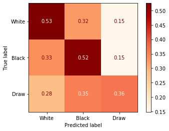


With SMOTE, we've gained a much higher degree of homogeneity at the cost of overall accuracy. Let's try a different model.

## Vanilla Decision Tree


```python
tree = DecisionTreeClassifier()
X_train, X_test, y_train, y_test = smote(scaled=True, verbose=True)

tree.fit(X_train, y_train)

test_preds = tree.predict(X_test)

print(tree.score(X_train, y_train))
print(tree.score(X_test, y_test))
```

    3    8360
    2    8360
    1    8360
    0    8360
    dtype: int64
    0    2787
    1    1580
    2     435
    3     213
    Name: victory_status, dtype: int64
    1.0
    0.53678963110668
    


```python
plot_confusion_matrix(tree, X_test, y_test, normalize='true')
```


    <sklearn.metrics._plot.confusion_matrix.ConfusionMatrixDisplay at 0x2a07f6d8710>


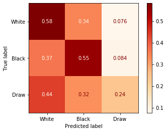


```python
plot_importance(tree.fit(X_train, y_train));
```


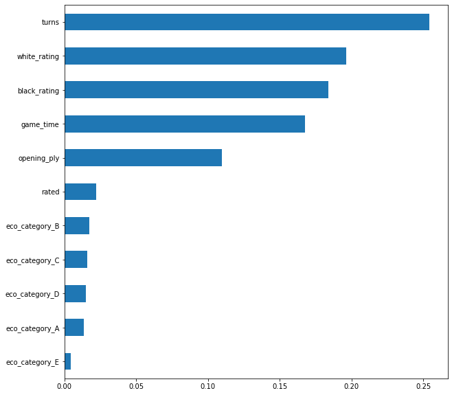


### Low Depth Decision Tree


```python
tree = DecisionTreeClassifier(max_depth=10)
X_train, X_test, y_train, y_test = smote(scaled=True, verbose=True, drop_cols=['victory_status','winner_draw'])

tree.fit(X_train, y_train)

test_preds = tree.predict(X_test)

print(tree.score(X_train, y_train))
print(tree.score(X_test, y_test))

plot_confusion_matrix(tree, X_test, y_test, normalize='true')
```

    3    8419
    2    8419
    1    8419
    0    8419
    dtype: int64
    0    2728
    1    1610
    2     444
    3     233
    Name: victory_status, dtype: int64
    0.7217899988122105
    0.5335992023928215
    


    <sklearn.metrics._plot.confusion_matrix.ConfusionMatrixDisplay at 0x2a00494d9b0>


```python
plot_importance(tree.fit(X_train, y_train),drop_cols=['victory_status','winner_draw']);
```


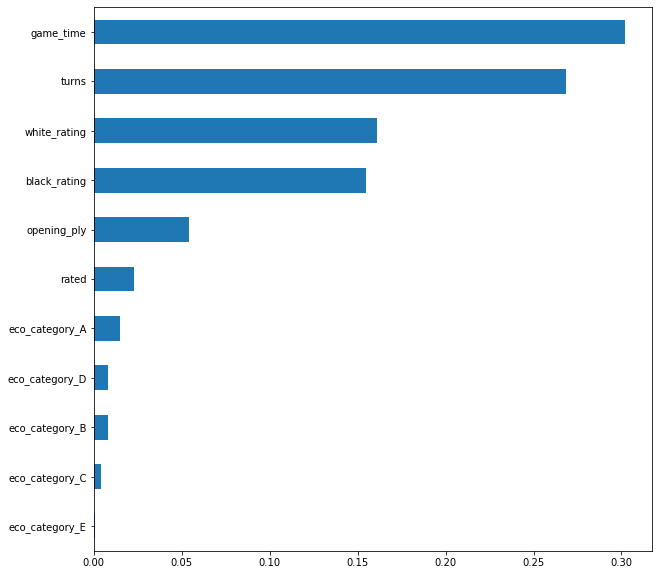


### Low Depth Decision Tree With Features Removed


```python
tree = DecisionTreeClassifier(max_depth=10)
X_train, X_test, y_train, y_test = smote(scaled=True, verbose=True, 
                                         drop_cols=['victory_status',
                                                    'winner_draw',
                                                    'winner_black'])

tree.fit(X_train, y_train)

test_preds = tree.predict(X_test)

print(tree.score(X_train, y_train))
print(tree.score(X_test, y_test))

plot_confusion_matrix(tree, X_test, y_test, normalize='true')
```

    3    8381
    2    8381
    1    8381
    0    8381
    dtype: int64
    0    2766
    1    1600
    2     418
    3     231
    Name: victory_status, dtype: int64
    0.6251342321918626
    0.46241276171485546
    


    <sklearn.metrics._plot.confusion_matrix.ConfusionMatrixDisplay at 0x2a004cbed30>


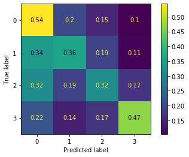


```python
plot_importance(tree.fit(X_train, y_train),drop_cols=['victory_status','winner_draw','winner_black']);
```


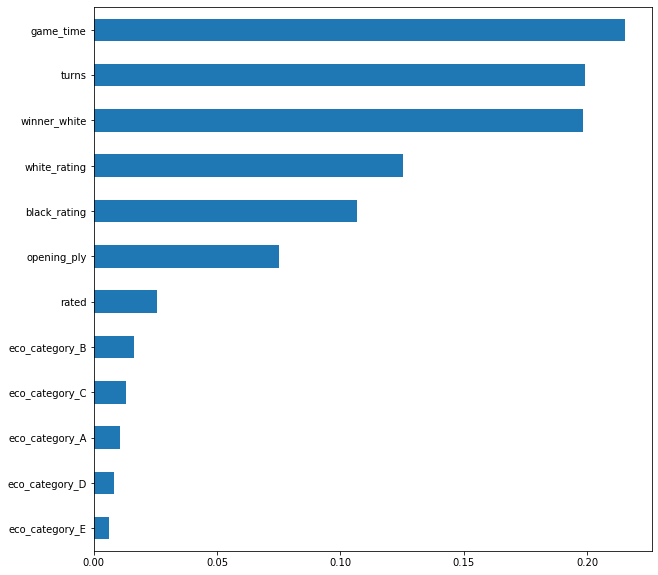


## Vanilla Bagging


```python
X_train, X_test, y_train, y_test = smote(scaled=True, verbose=True)

bag = BaggingClassifier(n_estimators=10)
bag.fit(X_train, y_train)
print(bag.score(X_train, y_train))
print(bag.score(X_test, y_test))
```

    3    8348
    2    8348
    1    8348
    0    8348
    dtype: int64
    0    2799
    1    1587
    2     396
    3     233
    Name: victory_status, dtype: int64
    0.9920340201245808
    0.5942173479561316
    


```python
plot_confusion_matrix(bag, X_test, y_test, normalize='true')
```


    <sklearn.metrics._plot.confusion_matrix.ConfusionMatrixDisplay at 0x2a005dc7518>


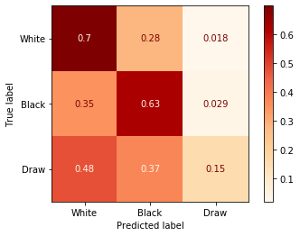


## Vanilla Random Forest


```python
# bootstrap aggregation is an improvement over KNN. Let's try RF
X_train, X_test, y_train, y_test = smote(scaled=False, verbose=True)

rf = RandomForestClassifier()

rf.fit(X_train, y_train)
print(rf.score(X_train, y_train))
print(rf.score(X_test, y_test))
```

    3    8342
    2    8342
    1    8342
    0    8342
    dtype: int64
    0    2805
    1    1609
    2     370
    3     231
    Name: victory_status, dtype: int64
    1.0
    0.6374875373878365
    


```python
plot_confusion_matrix(rf, X_test, y_test, normalize='true')
```


    <sklearn.metrics._plot.confusion_matrix.ConfusionMatrixDisplay at 0x2a0059f8588>


```python
plot_importance(rf.fit(X_train, y_train));
```


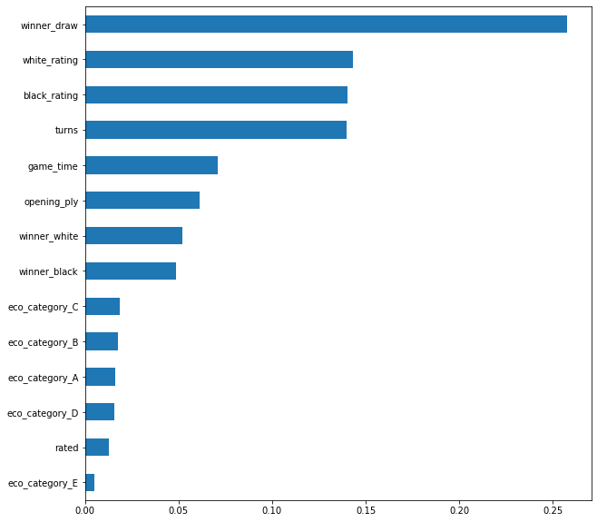


### Low Depth Random Forest


```python
rf = RandomForestClassifier(max_depth=10)

rf.fit(X_train, y_train)
print(rf.score(X_train, y_train))
print(rf.score(X_test, y_test))
```

    0.7761028530328459
    0.6279162512462613
    


```python
plot_confusion_matrix(rf, X_test, y_test, normalize='true')
```


    <sklearn.metrics._plot.confusion_matrix.ConfusionMatrixDisplay at 0x2a0059f8fd0>


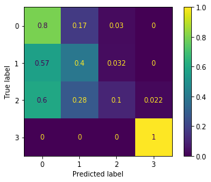


```python
plot_importance(rf.fit(X_train, y_train));
```


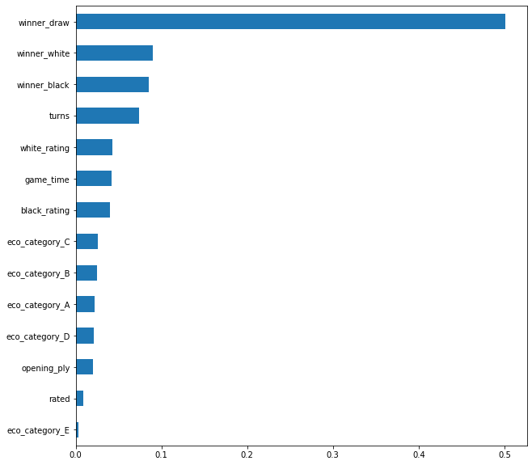


### Low Depth Random Forest With Features Removed


```python
X_train, X_test, y_train, y_test = smote(scaled=False, verbose=True, 
                                         drop_cols=['victory_status',
                                                    'winner_draw',
                                                    'winner_white'])

rf = RandomForestClassifier(max_depth=10)

rf.fit(X_train, y_train)
print(rf.score(X_train, y_train))
print(rf.score(X_test, y_test))

plot_confusion_matrix(rf, X_test, y_test, normalize='true')
```

    3    8366
    2    8366
    1    8366
    0    8366
    dtype: int64
    0    2781
    1    1568
    2     433
    3     233
    Name: victory_status, dtype: int64
    0.6658498685154196
    0.5485543369890329
    


    <sklearn.metrics._plot.confusion_matrix.ConfusionMatrixDisplay at 0x2a005bb0780>


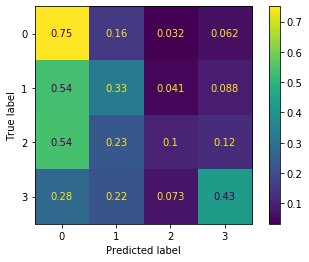


```python
plot_importance(rf.fit(X_train, y_train), drop_cols=['victory_status',
                                                     'winner_draw',
                                                     'winner_white']);
```


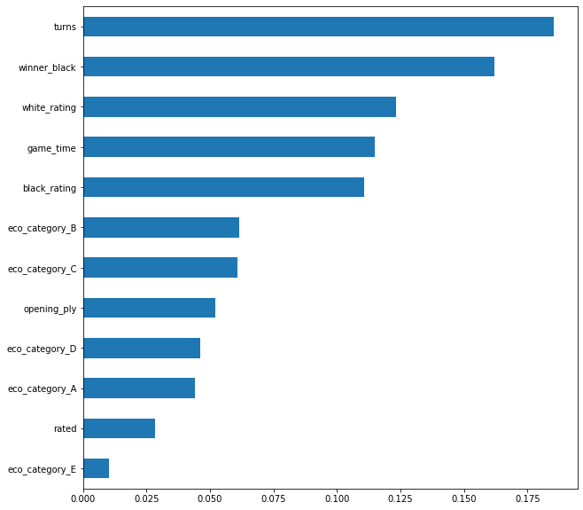


## Low Depth Extra Trees


```python
X_train, X_test, y_train, y_test = smote(scaled=False, verbose=True)

et = ExtraTreesClassifier(n_estimators=100, max_depth=10)
et.fit(X_train, y_train)

print(et.score(X_train, y_train))
print(et.score(X_test, y_test))
```

    3    8417
    2    8417
    1    8417
    0    8417
    dtype: int64
    0    2730
    1    1634
    2     421
    3     230
    Name: victory_status, dtype: int64
    0.7118331947249614
    0.6161515453639083
    


```python
plot_confusion_matrix(et, X_test, y_test, normalize='true')
```


    <sklearn.metrics._plot.confusion_matrix.ConfusionMatrixDisplay at 0x2a005f30c18>


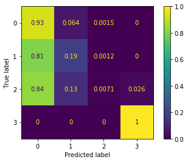


```python
plot_importance(et.fit(X_train, y_train));
```


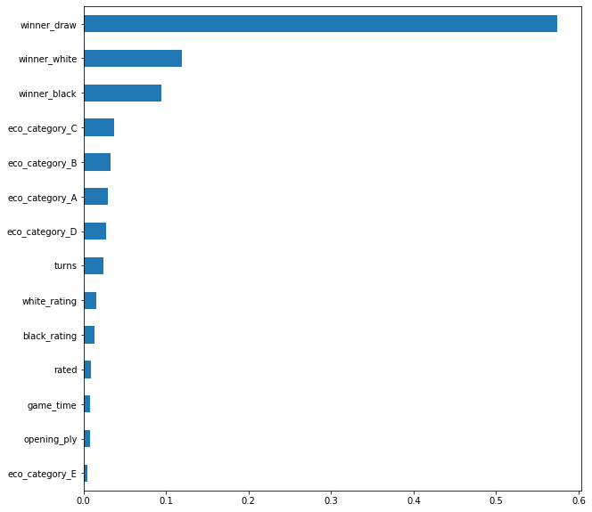


### Low Depth Extra Trees With Features Removed


```python
X_train, X_test, y_train, y_test = smote(scaled=True, verbose=True,
                                        drop_cols=['victory_status',
                                                     'winner_draw',
                                                     'winner_white'])

et = ExtraTreesClassifier(n_estimators=100, max_depth=10)
et.fit(X_train, y_train)

print(et.score(X_train, y_train))
print(et.score(X_test, y_test))

plot_confusion_matrix(et, X_test, y_test, normalize='true')
```

    3    8384
    2    8384
    1    8384
    0    8384
    dtype: int64
    0    2763
    1    1605
    2     416
    3     231
    Name: victory_status, dtype: int64
    0.5358122614503816
    0.3523429710867398
    


    <sklearn.metrics._plot.confusion_matrix.ConfusionMatrixDisplay at 0x2a0060d3c18>


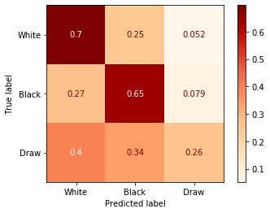


```python
plot_importance(et.fit(X_train, y_train), drop_cols=['victory_status',
                                                     'winner_draw',
                                                     'winner_white']);
```


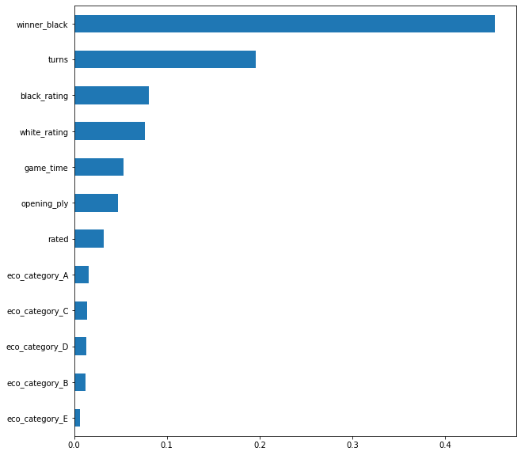


## Support Vector Machines


```python
X_train, X_test, y_train, y_test = smote(scaled=True, verbose=True)

clf = SVC(gamma='auto')
clf.fit(X_train, y_train)

print(clf.score(X_train, y_train))
print(clf.score(X_test, y_test))

plot_confusion_matrix(clf, X_test, y_test, normalize='true')
```

    3    8384
    2    8384
    1    8384
    0    8384
    dtype: int64
    0    2763
    1    1569
    2     429
    3     254
    Name: victory_status, dtype: int64
    0.650793177480916
    0.5046859421734795
    


    <sklearn.metrics._plot.confusion_matrix.ConfusionMatrixDisplay at 0x2a00476c160>


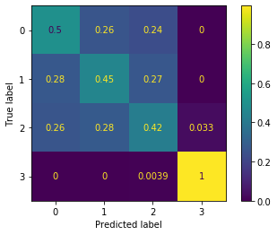


```python
kernels = ['linear','poly','sigmoid']

for kernel in kernels:

    clf = SVC(gamma='auto', kernel=kernel)
    clf.fit(X_train, y_train)
    print(clf.score(X_train, y_train))
    print(clf.score(X_test, y_test))
    plot_confusion_matrix(clf, X_test, y_test, normalize='true')
```

    0.5876968034351145
    0.5369890329012961
    0.6365100190839694
    0.5076769690927219
    0.4999701812977099
    0.3720837487537388
    


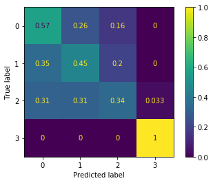


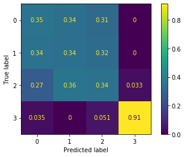


# Ensemble Methods

## AdaBoost With Low Depth Random Forest


```python
X_train, X_test, y_train, y_test = smote(scaled=True, verbose=True)

ada = AdaBoostClassifier(RandomForestClassifier(max_depth=10), learning_rate=0.1)
ada.fit(X_train, y_train)
print(ada.score(X_train, y_train))
print(ada.score(X_test, y_test))

plot_confusion_matrix(ada, X_test, y_test, normalize='true')
```

    3    8324
    2    8324
    1    8324
    0    8324
    dtype: int64
    0    2823
    1    1566
    2     405
    3     221
    Name: victory_status, dtype: int64
    0.852835175396444
    0.5880358923230309
    


    <sklearn.metrics._plot.confusion_matrix.ConfusionMatrixDisplay at 0x2a005b365f8>


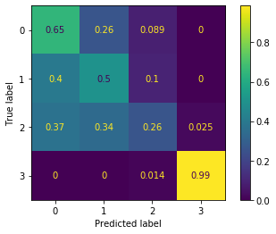


## Low Depth Gradient Boost


```python
X_train, X_test, y_train, y_test = smote(scaled=True, verbose=True)

grad = GradientBoostingClassifier(max_depth=10)
grad.fit(X_train, y_train)
print(grad.score(X_train, y_train))
print(grad.score(X_test, y_test))

plot_confusion_matrix(grad, X_test, y_test, normalize='true')
```

    3    8380
    2    8380
    1    8380
    0    8380
    dtype: int64
    0    2767
    1    1579
    2     442
    3     227
    Name: victory_status, dtype: int64
    0.9616050119331743
    0.6207377866400797
    


    <sklearn.metrics._plot.confusion_matrix.ConfusionMatrixDisplay at 0x2a0064b1828>


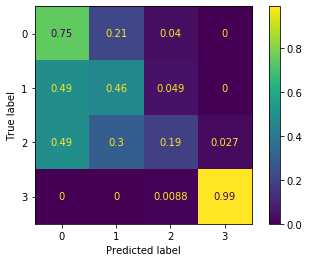


## Vanilla XGBoost


```python
X_train, X_test, y_train, y_test = smote(scaled=True, verbose=True)

xgb_rf = XGBRFClassifier()
xgb_rf.fit(X_train, y_train)
print(xgb_rf.score(X_train, y_train))
print(xgb_rf.score(X_test,y_test))
```

    3    8378
    2    8378
    1    8378
    0    8378
    dtype: int64
    0    2769
    1    1579
    2     431
    3     236
    Name: victory_status, dtype: int64
    0.6142874194318453
    0.481555333998006
    


```python
plot_confusion_matrix(xgb_rf, X_test, y_test, normalize='true')
```


    <sklearn.metrics._plot.confusion_matrix.ConfusionMatrixDisplay at 0x2a007c4b9e8>


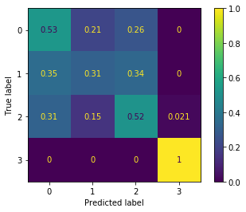


### High Depth XGBoost

While a max depth of 10 is low for a regular decision tree, it is rather high for an XGBoost algorithm. We'll use that depth here.


```python
X_train, X_test, y_train, y_test = smote(scaled=True, verbose=True)

xgb_rf = XGBRFClassifier(max_depth=10)
xgb_rf.fit(X_train, y_train)
print(xgb_rf.score(X_train, y_train))
print(xgb_rf.score(X_test,y_test))
```

    3    8378
    2    8378
    1    8378
    0    8378
    dtype: int64
    0    2769
    1    1582
    2     445
    3     219
    Name: victory_status, dtype: int64
    0.7710670804487945
    0.5824526420737787
    


```python
plot_confusion_matrix(xgb_rf, X_test, y_test, normalize='true')
```


    <sklearn.metrics._plot.confusion_matrix.ConfusionMatrixDisplay at 0x2a0063fee80>


```python
plot_importance(xgb_rf.fit(X_train, y_train))
```


    rated            0.00
    turns            0.02
    white_rating     0.01
    black_rating     0.01
    opening_ply      0.01
    game_time        0.02
    winner_black     0.40
    winner_draw      0.38
    winner_white     0.14
    eco_category_A   0.00
    eco_category_B   0.00
    eco_category_C   0.00
    eco_category_D   0.00
    eco_category_E   0.00
    dtype: float32


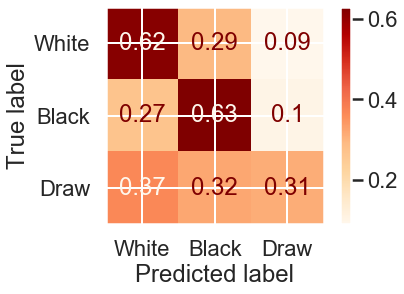


### High Depth XGBoost With Feature Removed


```python
X_train, X_test, y_train, y_test = smote(scaled=True, verbose=True, drop_cols=['victory_status',
                                                                               'winner_draw',
                                                                               'winner_black'])

xgb_rf = XGBRFClassifier(max_depth=10)
xgb_rf.fit(X_train, y_train)
print(xgb_rf.score(X_train, y_train))
print(xgb_rf.score(X_test,y_test))
```

    3    8386
    2    8386
    1    8386
    0    8386
    dtype: int64
    0    2761
    1    1617
    2     405
    3     232
    Name: victory_status, dtype: int64
    0.7169091342714047
    0.5106679960119641
    


```python
plot_confusion_matrix(xgb_rf, X_test, y_test, normalize='true')
```


    <sklearn.metrics._plot.confusion_matrix.ConfusionMatrixDisplay at 0x2a032a805c0>


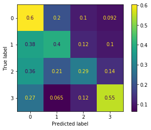


```python
plot_importance(xgb_rf.fit(X_train, y_train), drop_cols=['victory_status',
                                                         'winner_draw'])
```


    ---------------------------------------------------------------------------

    ValueError                                Traceback (most recent call last)

    <ipython-input-127-e5f100f86e91> in <module>
          1 plot_importance(xgb_rf.fit(X_train, y_train), drop_cols=['victory_status',
    ----> 2                                                          'winner_draw'])
    

    <ipython-input-17-896f0dc7cae9> in plot_importance(model, top_n, figsize, drop_cols)
         50 def plot_importance(model,top_n=20,figsize=(10,10), drop_cols=['victory_status']):
         51     df_importance = pd.Series(model.feature_importances_,
    ---> 52                               index=df.drop(drop_cols, axis=1).columns)
         53     df_importance.sort_values(ascending=True).tail(top_n).plot(
         54         kind='barh',figsize=figsize)
    

    ~\Anaconda3\envs\learn-env\lib\site-packages\pandas\core\series.py in __init__(self, data, index, dtype, name, copy, fastpath)
        300                         raise ValueError(
        301                             "Length of passed values is {val}, "
    --> 302                             "index implies {ind}".format(val=len(data), ind=len(index))
        303                         )
        304                 except TypeError:
    

    ValueError: Length of passed values is 12, index implies 13


## Random Forest With Gridsearch


```python
X_train, X_test, y_train, y_test = smote(scaled=True, verbose=True)
```

    3    8385
    2    8385
    1    8385
    0    8385
    dtype: int64
    0    2762
    1    1583
    2     432
    3     238
    Name: victory_status, dtype: int64
    


```python
go_ahead = input("Cell will take several minutes to run. Do you wish to run this cell (y/n)? ")

if go_ahead == 'y':

    rf_clf = RandomForestClassifier()
    grid = {'max_depth': [1,2,5,8,10],
            'criterion': ['gini'],
            'min_samples_split':[2,5,10],
            'min_samples_leaf':[1,3,5],
            'max_features': [1,3,5,10,14]}

    gridsearch = GridSearchCV(rf_clf, param_grid=grid, cv=5)

    forest_cv = gridsearch.fit(X_train, y_train)

    print(forest_cv.best_params_)
    
else:
    
    forest_cv.best_params_ = {'criterion': 'gini', 
                              'max_depth': 10, 
                              'max_features': 3, 
                              'min_samples_leaf': 1, 
                              'min_samples_split': 2}
    
print(forest_cv.best_params_)
```

    Cell will take several minutes to run. Do you wish to run this cell (y/n)? no
    {'criterion': 'gini', 'max_depth': 10, 'max_features': 3, 'min_samples_leaf': 1, 'min_samples_split': 2}
    


```python
forest = RandomForestClassifier(**forest_cv.best_params_)
forest.fit(X_train, y_train)

print(forest.score(X_train, y_train))
print(forest.score(X_test, y_test))
```

    0.7615384615384615
    0.5491525423728814
    


```python
plot_confusion_matrix(forest, X_test, y_test, normalize='true')
```


    <sklearn.metrics._plot.confusion_matrix.ConfusionMatrixDisplay at 0x2a02a5ebf98>


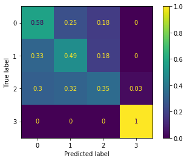


```python
plot_importance(forest.fit(X_train, y_train), drop_cols=['victory_status'])
```


    rated            0.01
    turns            0.09
    white_rating     0.05
    black_rating     0.05
    opening_ply      0.04
    game_time        0.07
    winner_black     0.14
    winner_draw      0.42
    winner_white     0.12
    eco_category_A   0.00
    eco_category_B   0.00
    eco_category_C   0.00
    eco_category_D   0.00
    eco_category_E   0.00
    dtype: float64


### Gridsearched Random Forest With Features Removed


```python
X_train, X_test, y_train, y_test = smote(scaled=True, verbose=True, 
                                         drop_cols=['victory_status',
                                                    'winner_draw',
                                                    'winner_black'])

forest = RandomForestClassifier(**forest_cv.best_params_)
forest.fit(X_train, y_train)

print(forest.score(X_train, y_train))
print(forest.score(X_test, y_test))
```

    3    8361
    2    8361
    1    8361
    0    8361
    dtype: int64
    0    2786
    1    1597
    2     427
    3     205
    Name: victory_status, dtype: int64
    0.7046704939600527
    0.4929212362911266
    


```python
plot_confusion_matrix(forest, X_test, y_test, normalize='true')
```


    <sklearn.metrics._plot.confusion_matrix.ConfusionMatrixDisplay at 0x2a02a509a20>


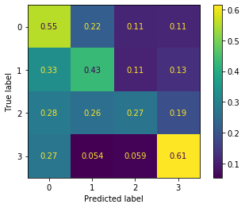


```python
plot_importance(forest.fit(X_train, y_train), drop_cols=['victory_status',
                                                         'winner_draw',
                                                         'winner_black'])
```


    rated            0.02
    turns            0.21
    white_rating     0.12
    black_rating     0.11
    opening_ply      0.09
    game_time        0.17
    winner_white     0.23
    eco_category_A   0.01
    eco_category_B   0.01
    eco_category_C   0.01
    eco_category_D   0.01
    eco_category_E   0.01
    dtype: float64


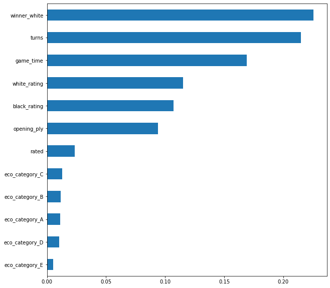


It's interesting to note that despite dropping two `winner` columns, we were still able to predict draws with 60% accuracy. Let's see what a single tree looks like with these columns removed.

### Single Tree With Gridsearch Parameters


```python
X_train, X_test, y_train, y_test = smote(scaled=True, verbose=True, 
                                         drop_cols=['victory_status',
                                                    'winner_draw',
                                                    'winner_black'])

tree = DecisionTreeClassifier(**forest_cv.best_params_)

tree.fit(X_train, y_train)

print(tree.score(X_train, y_train))
print(tree.score(X_test, y_test))
```

    3    8328
    2    8328
    1    8328
    0    8328
    dtype: int64
    0    2819
    1    1536
    2     435
    3     225
    Name: victory_status, dtype: int64
    0.5724363592699327
    0.4081754735792622
    


```python
from sklearn.tree import export_graphviz
from IPython.display import Image  
from pydotplus import graph_from_dot_data
import numpy as np

dot_data = export_graphviz(tree, out_file=None, 
                           feature_names=X.drop(['winner_draw',
                                                'winner_black'], axis=1).columns,  
                           class_names=y.unique().astype('str'), 
                           filled=True, rounded=True, special_characters=True,
                           rotate=True)

graph = graph_from_dot_data(dot_data)  

Image(graph.create_png())
```

    dot: graph is too large for cairo-renderer bitmaps. Scaling by 0.453234 to fit
    
    


```python
plot_confusion_matrix(tree, X_test, y_test, normalize='true')
```


    <sklearn.metrics._plot.confusion_matrix.ConfusionMatrixDisplay at 0x2a031c8eac8>


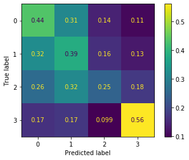


# Which Model is Best?

After running what seems like a dozen or more models, the next task is to choose the best one. Judging by raw accuracy, this seems to be the Low Depth Random Forest; this is strange, considering we ran a gridsearch to determine a set of values that performed worse than the default settings. High Depth XGBoost is also a front-runner, especially given its high accuracy-to-runtime ratio. 

The attribute that all these models have in common is an accuracy "ceiling" of around 64%. It's possible we might be able to edge over that with enough hyperparameter tuning, but it might also be literally impossible to get higher accuracy with the data we have at our disposal. We should consider that 60% accuracy is over twice as good as random guessing, and with this motivation, we should then pick models that have as little overfitting as possible, i.e. models that predict both training data and testing data with accuracy as close to 60% accuracy as possible. For these reasons, it is in our best interest to select the Low Depth Random Forest model. It has the highest overall accuracy rating, while still having an acceptable amount of overfitting and runtime.

# Conclusion

Using a Low Depth Random Forest model allows us to predict the endings of chess matches with over 60% accuracy, nearly 1.5 times as accurate as weighted guessing, and nearly 2.5 times as accurate as random guessing. 
